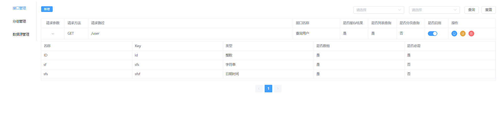

# LightAPI

#### 介绍

轻量接口生成工具，只需要一些必要配置和SQL语句即可生成一个接口

持久层使用了MyBatis框架，支持MyBatis的动态SQL，动态SQL语法参考 [MyBatis文档-动态SQL](https://mybatis.org/mybatis-3/zh/dynamic-sql.html)

理论上支持所有MyBatis框架支持的数据库，默认只有MySQL数据库的JDBC驱动，如果需要使用其它数据库，请自行添加对应的JDBC驱动依赖(MySQL驱动依赖是必需的)，例如:

##### MariaDB

```
<dependency>
    <groupId>org.mariadb.jdbc</groupId>
    <artifactId>mariadb-java-client</artifactId>
    <scope>runtime</scope>
</dependency>
```

##### PostgreSQL

```
<dependency>
    <groupId>org.postgresql</groupId>
    <artifactId>postgresql</artifactId>
    <scope>runtime</scope>
</dependency>
```

##### Oracle

```
<dependency>
    <groupId>com.oracle.database.jdbc</groupId>
    <artifactId>ojdbc8</artifactId>
    <scope>runtime</scope>
</dependency>
```

##### SQL Server

```
<dependency>
    <groupId>com.microsoft.sqlserver</groupId>
    <artifactId>mssql-jdbc</artifactId>
    <scope>runtime</scope>
</dependency>
```

##### ClickHouse

```
<dependency>
    <groupId>ru.yandex.clickhouse</groupId>
    <artifactId>clickhouse-jdbc</artifactId>
    <version>0.3.1-patch</version>
    <scope>runtime</scope>
</dependency>
```

#### 演示

##### 新增数据源配置


##### 新增接口配置-基础配置


##### 新增接口配置-参数配置


##### 新增接口配置-SQL配置


##### 查看接口



##### 测试接口

